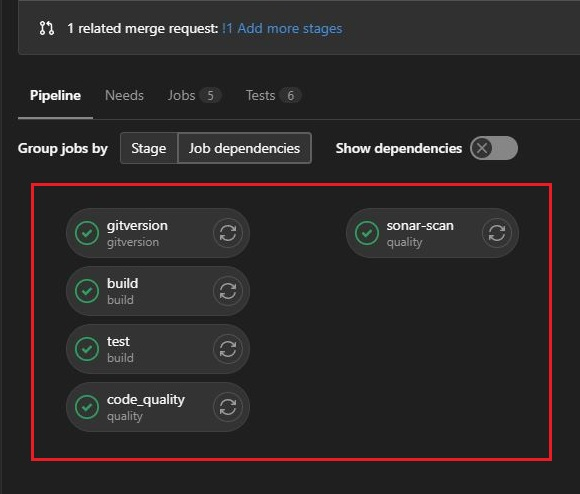
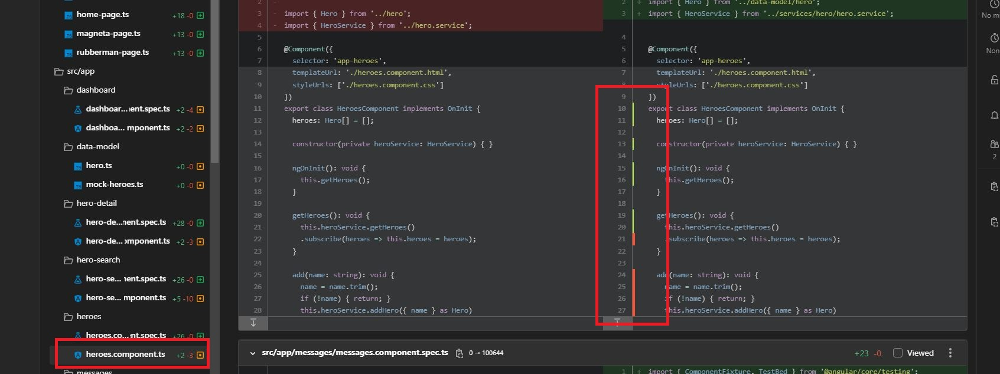
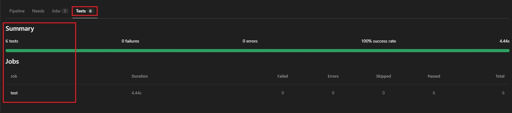
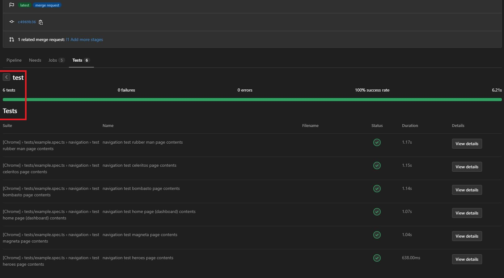
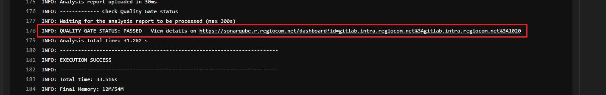
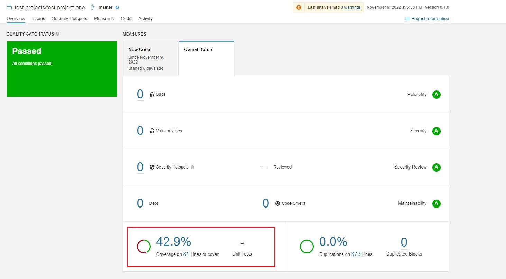
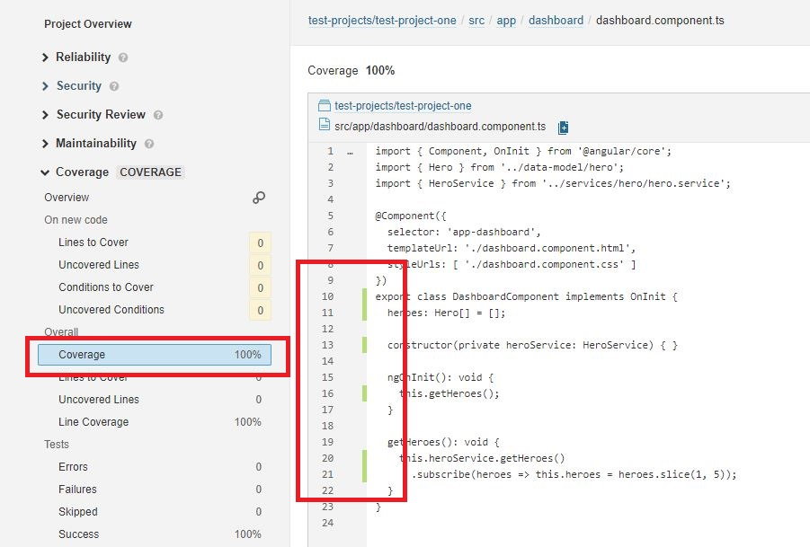

# Test Project One

This is a Sample Angular project developed using Typescript, based on the [Tour of Heroes Tutorial](https://angular.io/tutorial) in the [official Angular Website](https://angular.io/). It runs on [Angular 14](https://www.freelancermap.com/blog/angular-14-new-features-and-updates-2022/), integrated with [Jasmine Unit Testing Framework](https://jasmine.github.io/) by default, used to run the Front-end Unit tests, with the intention to test the front-end code. We have also integrated the following to this project:-

- [Playwright](https://playwright.dev/), a testing framework capable of reliable and fast [Web Automation Testing](https://www.guru99.com/automation-testing.html) on multiple browsers, including [cross browser testing](https://developer.mozilla.org/en-US/docs/Learn/Tools_and_testing/Cross_browser_testing/Introduction) on [Chromium](https://www.chromium.org/Home/), [Firefox](https://www.mozilla.org/en-US/firefox/new/) and [WebKit](https://webkit.org/) with a single API.

- [Gitlab](https://about.gitlab.com/) to run the [CI/CD pipelines](https://docs.gitlab.com/ee/ci/pipelines/).

- [SonarQube](https://www.sonarqube.org/) to review the code analytics.

## Getting started

To configure the project locally, after [cloning](https://docs.gitlab.com/ee/gitlab-basics/start-using-git.html#clone-a-repository) the repository, an 'npm install' or 'yarn.install' command should be run, in order to set up and install all the necessary packages.

- To run the project, run 'ng serve' command, and run the project on 'http://localhost:4200/'. Or to automatically run the project on the default browser run the 'ng serve -o' command.

- To run the jasmine tests, run the 'ng test' command. It runs on a headless browser by default.
  - To run it on a chrome browser (only possible locally) for example, comment out the following lines as below,
    ```TypeScript
      /*  browsers: ["ChromeHeadlessNoSandbox"],
          customLaunchers: {
            ChromeHeadlessNoSandbox: {
              base: "ChromeHeadless",
              flags: ["--no-sandbox"],
            },
          }, */
    ```    
    and paste the line 
    ```TypeScript
      browsers: ["Chrome"]
    ```    
  - This is because the CI/CD pipelines cannot run tests on a headed browser.
  - To get the coverage results, run the command 'ng test --code-coverage'.
  - All the test reports (in this case the html, lcov and cobertura) will be generated in the 'artifacts/coverage' folder.

- To run the playwright tests, run the command 'npx playwright test ./tests'
  - All the playwright tests exists in the 'tests' folder.
  - All the reports (html, junit) are generated in the 'artifacts/tests' folder.


## Gitlab CI/CD pipelines

It is run when changes are made to the code, pushed in to the working branch and when a merge request is raised. It is to be noted that the pipelines are set to run only when a merge request is raised, or when changes are pushed to an existing merge request. It is configured through the '.gitlab-ci.yml' file. 

<div align="center">
  <p>
    
  </p>
</div>


It is used to automate the following :-

- It runs the angular unit tests, and after fetching the coverage report 'cobertura-coverage.xml' ([cobertura xml format](https://gist.github.com/apetro/fcfffb8c4cdab2c1061d)), it stores them to visualize the coverage in Gitlab, that looks like below. Please refer [this link](https://docs.gitlab.com/ee/ci/testing/test_coverage_visualization.html#how-test-coverage-visualization-works) to read more on this.

<p>
  
</p>

- It runs the playwright tests and fetch the 'junit-test-results.xml', to display the test results in Gitlab as below.

<p>
  
  
</p>

- Using the 'lcov' report it is used to anaylse the project in sonarqube as in the screenshots below. 

<p>
  
  
  
</p>

## For quick references

* **Gitlab** - https://about.gitlab.com/
* **CI/CD pipelines** - https://docs.gitlab.com/ee/ci/pipelines/
* **Angular.io Website** - https://angular.io/
* **Jasmine Unit Testing Framework** - https://jasmine.github.io/
* **Playwright.dev** - https://playwright.dev/
* **SonarQube** - https://www.sonarqube.org/
* **Automation Testing** - https://www.guru99.com/automation-testing.html
* **Tour of Heroes Tutorial** (Angular, TypeScript) - https://angular.io/tutorial
